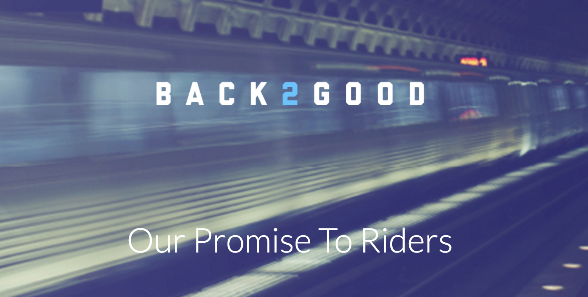

WMATA Rush Hour Promise data
----------------------------



The Washington Metropolitan Area Transportation Authority (or affectionally, WMATA) rolled out [the "Rush Hour Promise" program](https://www.wmata.com/fares/smartrip/rush-hour-promise.cfm) in 2018, as part of the organization's Back2Good initiative to revive its reputation. The Promise provides a full refund to Metrorail riders when train delays result in a significantly late arrival to their destinations, during peak commuting hours.

This repository demonstrates scraping the data from [WMATA's Daily Service Report Listings](https://www.wmata.com/service/daily-report/list.cfm), and structuring it into a CSV for analysis.

### Caveats to the data [[source](https://www.washingtonpost.com/news/dr-gridlock/wp/2018/01/11/is-metros-rush-hour-promise-as-good-as-it-sounds/)]

- A rider's SmarTrip transit card must be registered online in order to receive the credit
- A rider may only receive a credit up to four times each month
- Many components of the Metrorail wait time, including single-tracking and headway wait between trains, are factored into WMATA's time expectations

### Scraping the data

Install the requirements using `bundle install`, under Ruby 2.6.

Execute `./scraper.rb` to receive a running log as data is scraped:

```
$ ./scraper.rb
2018-11-27: on-time 87.8%, <5 mins late 95.4%, 285 received credit
2018-11-26: on-time 84.3%, <5 mins late 93.8%, 593 received credit
2018-11-25: Ignoring a Sunday
2018-11-24: Ignoring a Saturday
2018-11-23: on-time 89.9%, <5 mins late 96.9%, 184 received credit
2018-11-22: Ignoring a holiday
2018-11-21: on-time 91.8%, <5 mins late 97.6%, 430 received credit
2018-11-20: on-time 90.4%, <5 mins late 96.8%, 1,474 received credit
2018-11-19: on-time 92.6%, <5 mins late 97.7%, 881 received credit
2018-11-18: Ignoring a Sunday
...
```

Upon completion, the data is stored in the `rush_hour_promise.csv` file.

### Insights from the data

_Calculated as of January 21, 2018._

- The median number of riders receiving credit each day is 640
- On median, 90.7% of riders arrive on-time and 97.4% of riders arrive no more than 5 minutes late, according to WMATA's trip-duration expectations
- The three worst days from a Promise credit perspective were February 28, April 17, and December 11, during which less than 84% of rides were timely, and over 17,000 riders received Rush Hour Promise credit
- The ten worst days from an on-time perspective were all in August 2018; on the weekdays between the 13th and the 24th, no more than 73% of riders arrived on-time
